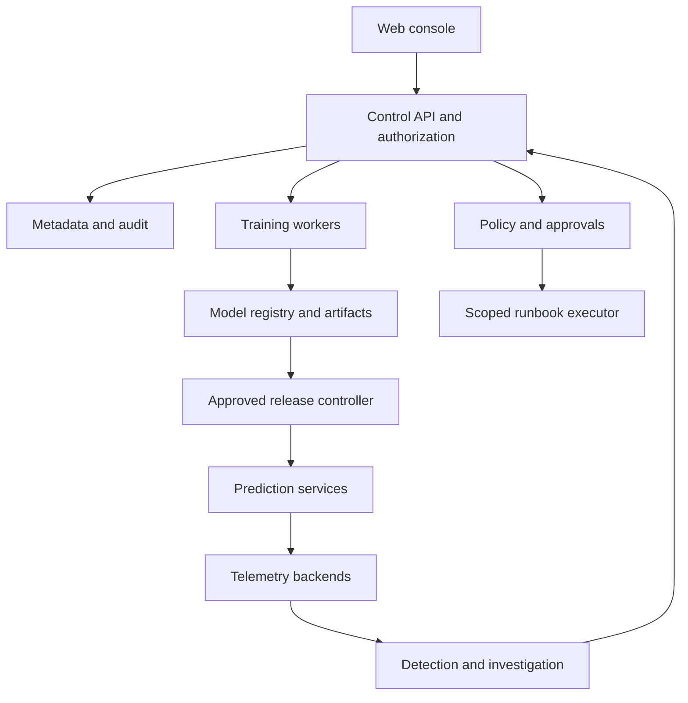

# Architecture pack (SRS 8.x)

## Responsibilities

Console → control API + authz → metadata/audit → training workers → registry →
release controller → serving → telemetry backends → detection/investigation →
policy → scoped executor.

## Trust boundaries

OIDC at edge; server-side project/env checks; executor identity separate from
policy writers; secrets by reference only; artifact signatures verified before load.

## ADRs

- ADR-001 modular monolith + isolated workers.
- ADR-02 Postgres job/outbox, no Kafka at pilot scale.
- ADR-03 digests are release identity; aliases are pointers.
- ADR-04 Git holds desired state; rollback reconciles Git.

## Data flow

